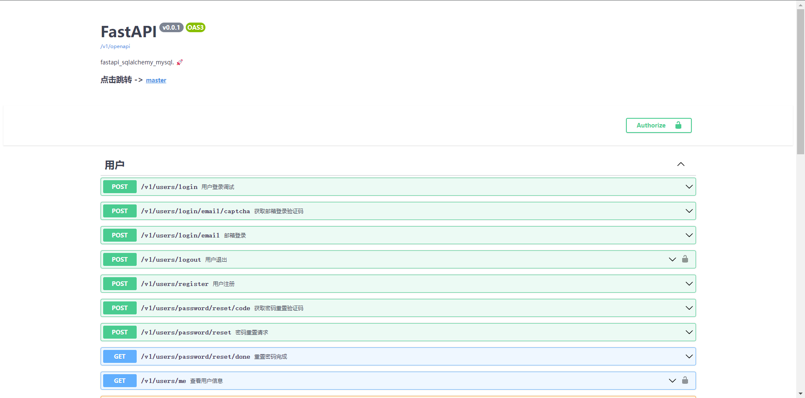

# FastAPI Project Demo

###### 声明：此仓库仅做为 FastAPI 入门级参考

📢 开箱即用, 所有接口采用 restful 风格

## 分支说明

### 异步：

#### async -> master

```text
fastapi + sqlalchyme + alembic + aiomysql + aioredis

📢: 含 redis 邮箱验证码登录
```

#### async -> async-APScheduler

```text
fastapi + sqlalchyme + alembic + aiomysql + aioredis + APScheduler

📢: 在 master 分支基础上扩展, 加入 APScheduler 定时任务
✨: 删除了邮箱验证码登录, 新增了图片验证码登录
❗：很遗憾，此分支已停止维护，仅作为异步图形验证码登陆保留
```

#### async -> async-CRUDBase

```text
fastapi + sqlalchyme + alembic + aiomysql + aioredis + APScheduler

📢: 在 master 分支基础上扩展，对普通 CRUD 操作进行封装，加入 APScheduler 定时任务
```

#### async -> async-Plus

```text
fastapi + sqlalchyme + alembic + aiomysql + aioredis + APScheduler + pycasbin

📢: 在 async-CRUDBase 分支基础上扩展，加入 RBAC 鉴权
```

### 同步：

#### sync -> sync

```text
fastapi + sqlalchyme + alembic + pymysql + redis

📢: 含 redis 图片验证码登录
```

#### sync -> sync-CRUDBase

```text
fastapi + sqlalchyme + alembic + pymysql + redis + APScheduler

📢: 在 sync 分支基础上扩展，对普通 CRUD 操作进行封装，加入 APScheduler 定时任务
```

#### sync -> sync-Plus

```text
fastapi + sqlalchyme + alembic + pymysql + redis + APScheduler + pycasbin

📢: 在 sync-CRUDBase 分支基础上扩展，加入 RBAC 鉴权
```

## 下载：

### 1. 克隆仓库

```shell
#全部分支:
git clone https://gitee.com/wu_cl/fastapi_sqlalchemy_mysql.git

#指定分支:
git clone -b 分支名 https://gitee.com/wu_cl/fastapi_sqlalchemy_mysql.git
```

### 2. 使用 CLI

[跳转 Gitee](https://gitee.com/wu_cl/fastapi_ccli)

[跳转 GitHub](https://github.com/wu-clan/fastapi_ccli)

## 安装使用:

### 1：传统

first > 项目根目录下安装所需依赖包

```shell
pip install -r requirements.txt
```

next > 配置数据库，执行迁移

```text
1 > 修改 core/conf.py 文件中数据库配置

2 > 终端进入 backend/app/ 目录下, 生成迁移文件
    执行: alembic revision --autogenerate

3 > 执行迁移: alembic upgrade head

4 > 运行 init_test_data.py 文件，初始化测试用户
```

next > 启动 redis 服务

next > 运行 main.py 文件启动 FastAPI

end > 打开浏览器,访问 http://127.0.0.1:8000/v1/docs/

example:


### 2：docker

###### 😓待完善

## 目录结构

结构树基本大致相同，详情请查看源代码

```text
├── backend
│   └── app
│       ├── alembic
│       ├── api
│       │   └── v1
│       ├── common
│       ├── core
│       ├── crud
│       ├── database
│       ├── middleware
│       ├── models
│       ├── schemas
|       |—— static
│       ├── test
│       └── utils
├── LICENSE
├── README.md
└── requirements.txt
```